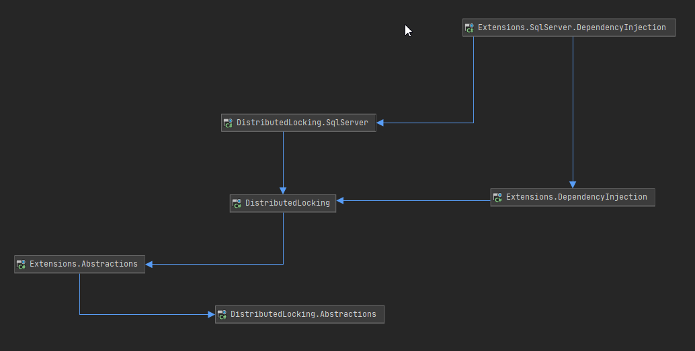

# DistributedLocking
DistributedLocking C# library

## Overview

This library delivers abstractions and standard implementation of distributed locking mechanism in C#.
The goal for this library is to be easily maintainable and easily extendable.

Personally, I pay attention to dependencies and that's why this package is built with multiple small packages; i.e. SQL implementation is a separate NuGet package so that people who'd like to use the library with a different database would not have to include dependencies to SQL libraries.

If you have any questions and/or suggestions - feel free to propose them!
I'm always looking for better solutions.

## Quick start

### Dependency registration

First, you need to register the distributed locking implementation.
Depending on the underlying database implementation the actual extension method can differ but for example purposes let's use a non-specific registration (for specific databases the details can differ, check the details in [samples section](#samples))
```csharp
services.AddDistributedLocking();
```

### Distributed locking initialization

Before using the distributed lock, you need to initialize it. This is because the implementation of the lock relies on a database; in order for that to work correctly, the code needs to initialize a table in the database that can store the locks.

An example:
```csharp
var initializer = serviceProvider.GetRequiredService<IDistributedLockRepositoryInitializer>();
await initializer.InitializeAsync(CancellationToken.None);
```

### Usage

From now on you can use the locking mechanism, there are two different ways to use it;

#### Acquiring a lock

Regardless of the way you decide to use to acquire a lock, the same parameters will be used;
- *identifier*: the lock key; if a lock is acquired successfully for an identifier - until the TTL (time to live/lease time) expires, the identifier cannot be used in another lock.
- *time to live*: defines how long the lock should remain "acquired" before it's automatically released.

  Why is this needed? Simply because the program can fail at a random moment, before releasing the lock.

  In a production system it's unacceptable to have a resource locked *forever* and that's why we need to define a TTL before acquiring the lock.

##### Using repository

###### Using repository and trying to acquire *LockId*

```csharp
var repository = provider.GetRequiredService<IDistributedLockRepository>();

var identifier = Guid.Parse("6B9E4911-6B2C-498F-82BE-B224AC4C5686");
var timeToLive = TimeSpan.FromSeconds(30);

var (success, lockId) = await repository.TryAcquireAsync(
    identifier,
    timeToLive,
    CancellationToken.None);
```

If the *success* value is *FALSE*, it means the lock was not acquired - most likely because the identifier is currently in use.

If the *success* value is *TRUE*, it means the lock was successfully acquired and the *lockId* variable holds your lock ID.

###### Using repository and trying to acquire *IDistributedLock*

```csharp
var repository = provider.GetRequiredService<IDistributedLockRepository>();

var identifier = Guid.Parse("6B9E4911-6B2C-498F-82BE-B224AC4C5686");
var timeToLive = TimeSpan.FromSeconds(30);

var (success, distributedLock) = await repository.TryAcquireLockAsync(
    identifier,
    timeToLive,
    CancellationToken.None);
```

If the *success* value is *FALSE*, it means the lock was not acquired - most likely because the identifier is currently in use.

If the *success* value is *TRUE*, it means the lock was successfully acquired and the *distributedLock* variable holds your *IDistributedLock* object.

##### Using facade

The facade allows you to acquire *IDistributedLock* object or throw in case of failure.

###### Using facade and acquiring or throwing

```csharp
var distributedLockFacade = provider.GetRequiredService<IDistributedLockFacade>();

var identifier = Guid.Parse("6B9E4911-6B2C-498F-82BE-B224AC4C5686");
var timeToLive = TimeSpan.FromSeconds(30);

var distributedLock = await distributedLockFacade.AcquireAsync(
    identifier,
    timeToLive,
    CancellationToken.None);
```

You can use an extension method that will simply throw *CouldNotAcquireLockException* in case the lock identifier was unavailable.

In case of success, you'll have the *IDistributedLock* object assigned to *distributedLock* variable, of course.

###### Using facade and acquiring or throwing with retries; timeouts

```csharp
var distributedLockFacade = provider.GetRequiredService<IDistributedLockFacade>();

var identifier = Guid.Parse("6B9E4911-6B2C-498F-82BE-B224AC4C5686");
var timeToLive = TimeSpan.FromSeconds(30);
var timeout = TimeSpan.FromMinutes(10);
var delayBetweenRetries = TimeSpan.FromSeconds(10);

var distributedLock = await distributedLockFacade.AcquireAsync(
    identifier,
    timeToLive,
    timeout,
    delayBetweenRetries,
    CancellationToken.None);
```

You can use an extension method that will throw *CouldNotAcquireLockException* in case the lock identifier was unavailable.

At the same time, it will retry acquiring it every *delayBetweenRetries* until *timeout* expires.

In case of success, you'll have the *IDistributedLock* object assigned to *distributedLock* variable, of course.

###### Using facade and acquiring or throwing with retries; customized timeouts

```csharp
var distributedLockFacade = provider.GetRequiredService<IDistributedLockFacade>();

var identifier = Guid.Parse("6B9E4911-6B2C-498F-82BE-B224AC4C5686");
var timeToLive = TimeSpan.FromSeconds(30);
var timeout = TimeSpan.FromMinutes(10);
var delayBetweenRetriesFunc = new Func<RetryExecutionMetadata, TimeSpan>(metadata => (...));

var distributedLock = await distributedLockFacade.AcquireAsync(
    identifier,
    timeToLive,
    timeout,
    delayBetweenRetriesFunc,
    CancellationToken.None);
```

You can use an extension method that will throw *CouldNotAcquireLockException* in case the lock identifier was unavailable.

At the same time, it will retry acquiring it with the delay returned by *delayBetweenRetriesFunc*.

In case of success, you'll have the *IDistributedLock* object assigned to *distributedLock* variable, of course.

###### Using facade and acquiring or throwing with retries; custom policy

```csharp
var distributedLockFacade = provider.GetRequiredService<IDistributedLockFacade>();

var identifier = Guid.Parse("6B9E4911-6B2C-498F-82BE-B224AC4C5686");
var timeToLive = TimeSpan.FromSeconds(30);
IRetryPolicy customPolicy = (...);

var distributedLock = await distributedLockFacade.AcquireAsync(
    identifier,
    timeToLive,
    customPolicy,
    CancellationToken.None);
```

You can also use the default method that will throw *CouldNotAcquireLockException* in case the lock identifier was unavailable, however it'll retry based on the *IRetryPolicy* implementation.

In case of success, you'll have the *IDistributedLock* object assigned to *distributedLock* variable, of course.

#### Extending lock's TTL

If you've already acquired a distributed lock and decided that you'll need more time than the original TTL, you can extend it's TTL (time to live/lease time).

##### Using repository

###### Using repository and *LockId*

```csharp
var extendingResult = await repository.TryExtendAsync(
    identifier,
    lockId,
    timeToLive,
    CancellationToken.None);
```

- *extendingResult* is a boolean that defines if extending succeeded.
- *identifier* is the lock identifier you've used to acquire the lock.
- *lockId* is the lockId you've got when acquiring the lock.
- *timeToLive* is the time the lock should be active *from now on*; regardless of what was the original TTL, the TTL you provide here will be active from now on (if the call succeeds).

###### Using repository and *IDistributedLock*

```csharp
var extendingResult = await repository.TryExtendAsync(
    distributedLock,
    timeToLive,
    CancellationToken.None);
```

- *distributedLock* is the lock you've acquired.
- *timeToLive* is the time the lock should be active *from now on*; regardless of what was the original TTL, the TTL you provide here will be active from now on (if the call succeeds).

##### Using *IDistributedLock*

```csharp
var extendingResult = await distributedLock.TryExtendAsync(
    timeToLive,
    CancellationToken.None);
```

- *distributedLock* is the lock you've acquired.
- *timeToLive* is the time the lock should be active *from now on*; regardless of what was the original TTL, the TTL you provide here will be active from now on (if the call succeeds).

##### Using facade

The facade allows you to extend *IDistributedLock* or throw in case of failure.

###### Using facade and extending or throwing

```csharp
await distributedLockFacade.ExtendAsync(
    distributedLock,
    timeToLive,
    CancellationToken.None);
```

You can use an extension method that will simply throw *CouldNotExtendLockException* in case the action was unavailable.

###### Using facade and extending or throwing with retries; timeouts

```csharp
var timeout = TimeSpan.FromMinutes(10);
var delayBetweenRetries = TimeSpan.FromSeconds(10);

await distributedLockFacade.ExtendAsync(
    distributedLock,
    timeToLive,
    timeout,
    delayBetweenRetries,
    CancellationToken.None);
```

You can use an extension method that will throw *CouldNotExtendLockException* in case the action was unavailable.

At the same time, it will retry extending it every *delayBetweenRetries* until *timeout* expires.

###### Using facade and extending or throwing with retries; customized timeouts

```csharp
var timeout = TimeSpan.FromMinutes(10);
var delayBetweenRetriesFunc = new Func<RetryExecutionMetadata, TimeSpan>(metadata => (...));

await distributedLockFacade.ExtendAsync(
    distributedLock,
    timeToLive,
    timeout,
    delayBetweenRetriesFunc,
    CancellationToken.None);
```

You can use an extension method that will throw *CouldNotExtendLockException* in case the action was unavailable.

At the same time, it will retry extending it with the delay returned by *delayBetweenRetriesFunc*.

###### Using facade and acquiring or throwing with retries; custom policy

```csharp
var timeToLive = TimeSpan.FromSeconds(30);
IRetryPolicy customPolicy = (...);

await distributedLockFacade.ExtendAsync(
    distributedLock,
    timeToLive,
    customPolicy,
    CancellationToken.None);
```

You can also use the default method that will throw *CouldNotExtendLockException* in case the action was unavailable, however it'll retry based on the *IRetryPolicy* implementation.

#### Releasing a lock

If you've already acquired a distributed lock and decided that you want to release it instead of waiting for the TTL to expire, you can use dedicated API for that.

##### Using repository

###### Using repository and *LockId*

```csharp
var releasingResult = await repository.TryReleaseAsync(
  identifier,
  lockId,
  CancellationToken.None);
```

- *releasingResult* is a boolean that defines if releasing succeeded.
- *identifier* is the lock identifier you've used to acquire the lock.
- *lockId* is the lockId you've got when acquiring the lock.

###### Using repository and *IDistributedLock*

```csharp
await distributedLockFacade.ReleaseAsync(
  distributedLock,
  CancellationToken.None);
```

- *distributedLock* is the lock you've acquired.

##### Using *IDistributedLock*

###### Using *IDistributedLock* and *DisposeAsync* method explicitly

```csharp
await distributedLock.DisposeAsync();
```

- *distributedLock* is the lock you've acquired.

###### Using *IDistributedLock* and *using* functionality

```csharp
await using(distributedLock)
{
  ...
}
```

- *distributedLock* is the lock you've acquired.

##### Using facade

The facade allows you to release *IDistributedLock* or throw in case of failure.

###### Using facade and releasing or throwing

```csharp
await distributedLockFacade.ReleaseAsync(
    distributedLock,
    CancellationToken.None);
```

You can use an extension method that will simply throw *CouldNotReleaseLockException* in case the action was unavailable.

###### Using facade and releasing or throwing with retries; timeouts

```csharp
var timeout = TimeSpan.FromMinutes(10);
var delayBetweenRetries = TimeSpan.FromSeconds(10);

await distributedLockFacade.ReleaseAsync(
    distributedLock,
    timeout,
    delayBetweenRetries,
    CancellationToken.None);
```

You can use an extension method that will throw *CouldNotReleaseLockException* in case the action was unavailable.

At the same time, it will retry releasing it every *delayBetweenRetries* until *timeout* expires.

###### Using facade and releasing or throwing with retries; customized timeouts

```csharp
var timeout = TimeSpan.FromMinutes(10);
var delayBetweenRetriesFunc = new Func<RetryExecutionMetadata, TimeSpan>(metadata => (...));

await distributedLockFacade.ReleaseAsync(
    distributedLock,
    timeout,
    delayBetweenRetriesFunc,
    CancellationToken.None);
```

You can use an extension method that will throw *CouldNotReleaseLockException* in case the action was unavailable.

At the same time, it will retry releasing it with the delay returned by *delayBetweenRetriesFunc*.

###### Using facade and releasing or throwing with retries; custom policy

```csharp
var timeToLive = TimeSpan.FromSeconds(30);
IRetryPolicy customPolicy = (...);

await distributedLockFacade.ReleaseAsync(
    distributedLock,
    customPolicy,
    CancellationToken.None);
```

You can also use the default method that will throw *CouldNotReleaseLockException* in case the action was unavailable, however it'll retry based on the *IRetryPolicy* implementation.

## Currently supported databases

- [SqlServer](./DistributedLocking.SqlServer)

## Versioning

This library is going to use [SemVer versioning](https://semver.org/).
A short summary:
- MAJOR version introduces breaking changes - check release notes before doing so.
- MINOR version introduces new functionalities - no need to worry about it before upgrading.
- PATCH version introduces bug fixed - please update as soon as possible.

## Dependencies
As you can see below, the dependencies between projects are organized in a hierarchy.

The goal of the design is to manage dependencies so that the most stable package (abstractions) would not need to change because of i.e. a bug in the implementation or a change that optimizes the implementation. This way, multiple projects can use the abstractions package and not risk having to update it with every bugfix.

Ideally, I'd like to update the abstractions package only for major version changes (if at all).
So I strongly suggest to rely on the abstractions package in your projects and reference any other package only in the highest level of your solution so that upgrading it would always be easy.

And here's the overview of the packages:
- *DistributedLocking.Abstractions* is the package that does not have any dependencies and thus is the most stable one; if we change something in this package, all of the other ones would have to (most likely; depending on the change itself) change as well.
- *DistributedLocking.Extensions.Abstractions* provides utility methods on the abstractions that make it easier to work with them. This package can change and is only dependent on the abstractions package.
- *DistributedLocking* is the default implementation of the lock; it doesn't include any specific database implementation, but has all the other pieces required to make the basic interfaces work. It uses *Extensions.Abstractions* package but is dependent on *Abstractions* themself.
- *DistributedLocking.Extensions.DependencyInjection* contains an extension method that registers every default implementation of an interface from abstractions package (apart from the actual database related interfaces).
  
Databases:
- SqlServer:
    - *DistributedLocking.SqlServer* contains SqlServer implementation of database related interfaces.
    - *DistributedLocking.Extensions.SqlServer.DependencyInjection* contains an extension method that registers every default implementation of an interface from abstractions package (with SqlServer database related classes).



## DependencyInjection

All of the dependency injection projects rely on *Microsoft.Extensions.DependencyInjection.Abstractions* package. 

### What if I'm using a different dependency injection library?

Most of the other dependency injection libraries support including the Microsoft's registrations. If yours doesn't - feel free to create a pull request.

### What if I want to use a different implementation of a specific interface?

All of the registrations use the *TryAdd(...)* methods which means you can override these registrations on your own.

## Samples

All of the sample can be found under [*Samples* directory](./Samples);

- [SQLServer sample](./Samples/SqlServerConsoleApplicationSample)